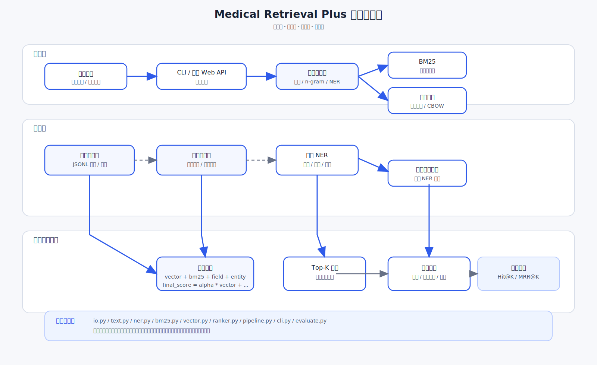

# 系统架构图

## 架构说明

本项目采用四层结构：

1. 输入层接收用户查询，当前入口是 CLI，后续可扩展为 Web API。
2. 检索层执行查询预处理、规则 NER、BM25 和向量检索。
3. 排序层融合 `vector_score`、`bm25_score`、字段命中和实体命中。
4. 输出层展示 Top-K 结果、命中实体和分数拆解。

## 目录映射

| 模块 | 职责 |
| --- | --- |
| `src/medical_retrieval/data/io.py` | 读取配置和 JSONL 文档 |
| `src/medical_retrieval/nlp/text.py` | 分词、n-gram 和文本归一化 |
| `src/medical_retrieval/nlp/ner.py` | 规则医学实体抽取 |
| `src/medical_retrieval/retrieval/bm25.py` | BM25 打分 |
| `src/medical_retrieval/retrieval/vector.py` | 向量编码和余弦相似度 |
| `src/medical_retrieval/retrieval/ranker.py` | 字段加权和实体加权 |
| `src/medical_retrieval/retrieval/pipeline.py` | 检索流程编排 |
| `src/medical_retrieval/app/cli.py` | 命令行入口 |
| `src/medical_retrieval/app/evaluate.py` | 离线评估 |
